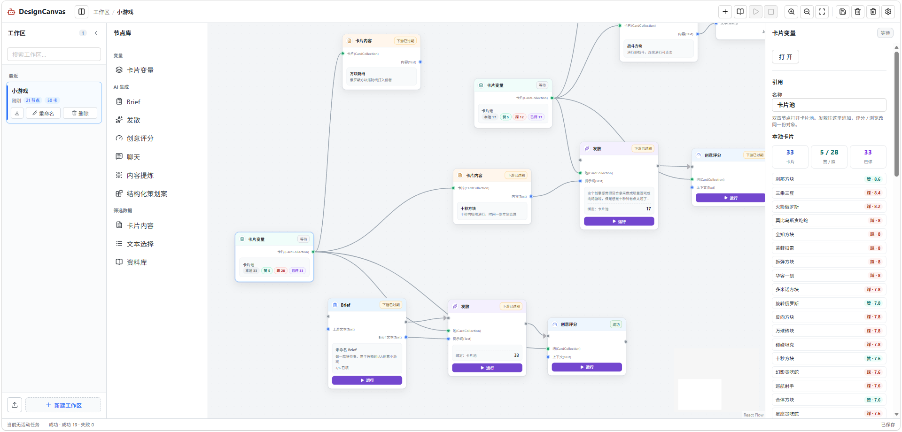
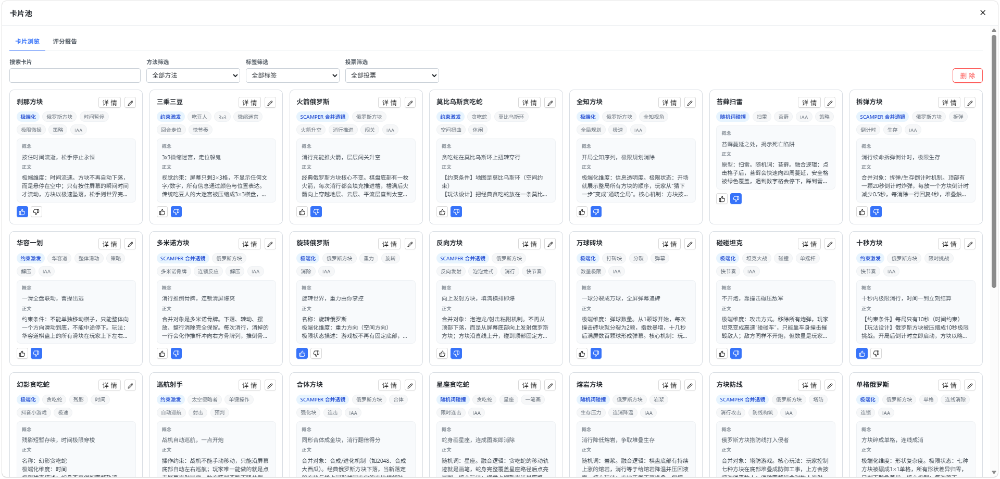
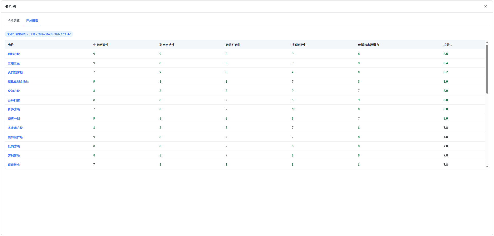
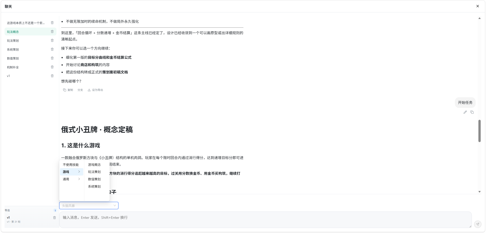
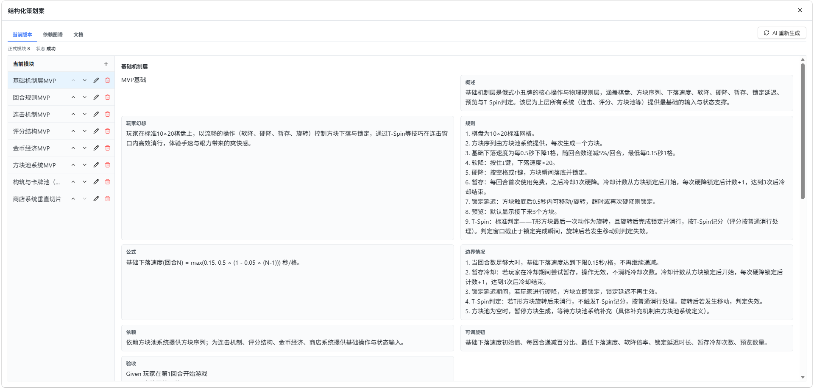
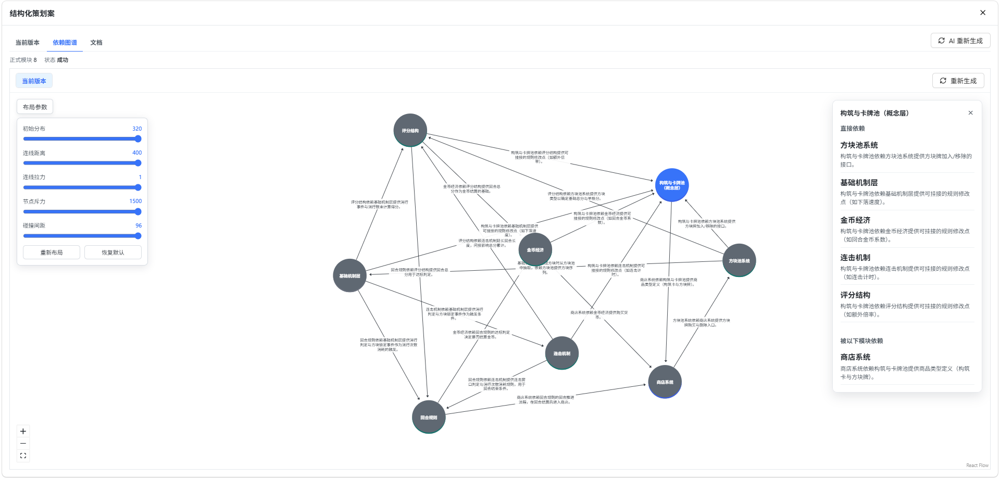
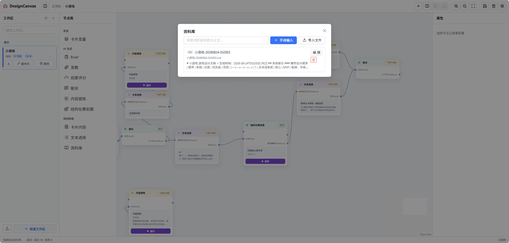

# DesignCanvas 节点指南

[English](NODES_EN.md) · 中文 · [返回 README](../README.md)

DesignCanvas 当前提供 10 个节点，分为**变量**、**AI 生成**和**筛选数据**三类。本文介绍各节点的用途、端口和主要操作，并给出常见连接方式。

## 工作台与连线

新工作区以空白画布开始。可从左侧节点库添加节点，通过节点端口连接控制流或数据流。

### 基本规则

- **控制流**决定运行顺序。Brief、发散、创意评分、内容提炼和结构化策划案带有执行输入与执行输出。
- **数据流**在节点之间传递 `Text`、`TextStruct` 或 `CardCollection` 等内容。
- 除 `Text[]` 输入外，每个输入端口只能连接一条边。
- `TextStruct` 输入只接受 `TextStruct`；`TextStruct` 输出可以连接 `Text` 或 `Text[]` 输入。
- 工作流不允许形成环路。
- 选中控制流中的节点并点击工具栏运行按钮，会从该节点开始沿控制流向下执行。

## 变量

### 卡片变量

卡片变量是工作区内的创意卡片池。发散节点向池中追加卡片，创意评分节点将分数写回同一批卡片。

- **输入：** 无。
- **输出：** 卡片集合 `CardCollection`。
- **主要操作：** 双击节点打开卡片池；搜索、筛选、赞踩、编辑、删除或查看卡片详情。
- **连接限制：** 发散节点的卡片池输入和创意评分节点的卡片输入必须连接卡片变量。

评分完成后，可在卡片池的“评分报告”页按维度比较卡片。人工赞踩会优先于平均分参与排序和后续生成偏好。

## AI 生成

### Brief

Brief 将上游文本或自定义提示整理为游戏系统策划简报，适合在创意发散或结构化策划之前统一目标和约束。

- **输入：** 可选执行流 `exec`；可选文本 `source`。
- **输出：** 可选执行流 `execOut`；Brief 文本 `text`。
- **主要操作：** 编辑提示词与标题、背景、目标玩家、设计目标、硬约束、成功指标、范围外等字段。
- **注意：** 运行需要有效的 AI 配置；没有上游文本时仅使用节点提示词生成。

### 发散

发散节点根据需求、上游提示和所选发散方法批量生成创意卡片，并将结果追加到指定卡片变量。

- **输入：** 可选执行流 `exec`；卡片池 `pool`；可选文本 `prompt`。
- **输出：** 可选执行流 `execOut`。卡片通过节点操作直接写入卡片池，不提供独立数据输出。
- **主要操作：** 填写需求；让 AI 推断发散方法或手动选择方法；设置批量数量、并发数和温度。
- **注意：** `pool` 必须连接卡片变量。再次生成时，已有赞踩和评分会作为偏好参考。

### 创意评分

创意评分先从上下文推断评估维度，再按这些维度为卡片池中的创意评分。结果写回卡片并用于排序。

- **输入：** 可选执行流 `exec`；卡片集合 `cards`；可选文本 `context`。
- **输出：** 可选执行流 `execOut`。评分直接写回卡片池。
- **主要操作：** 推断评分维度；执行批量评分；在卡片池中查看评分报告。
- **注意：** `cards` 必须连接卡片变量；运行需要 AI 配置。

### 聊天

聊天节点用于围绕上游文本、卡片内容或参考资料开展多轮深挖。不同会话相互独立并在本地持久化。

- **输入：** 文本数组 `text`，可接受多路连接。
- **输出：** 结构化文本 `context`，由标记为导出的对话轮次组成。
- **主要操作：** 创建多个对话、切换技能、编辑最后一条消息、建立分支、导出或取消导出轮次。
- **注意：** 聊天不参与控制流；生成回复需要 AI 配置。

### 内容提炼

内容提炼使用 AI 将上游长文本压缩为摘要，适合在控制链中快速提取要点。

- **输入：** 可选执行流 `exec`；文本 `input`。
- **输出：** 可选执行流 `execOut`。
- **主要操作：** 运行节点并在节点内查看摘要及状态。
- **注意：** 摘要保存在节点配置中，没有可继续连接的文本输出端口。上游变化后，已有摘要会被标记为过期。

### 结构化策划案

结构化策划案把 Brief、聊天结果或其他文本整理为游戏系统模块。每个模块包含概述、规则、公式、验收条件等结构化内容。

- **输入：** 可选执行流 `exec`；文本 `input`。
- **输出：** 可选执行流 `execOut`；正式版本的模块集合 `modules`（`TextStruct`）。
- **主要操作：** 检查和编辑模块；比较当前版本与最新候选；保存正式版本；查看文档和依赖图谱。
- **注意：** 只保留明确系统及核心循环必需系统。保存当前版本会更新正式输出并将下游标记为过期；AI 再生成的内容先进入最新候选。

依赖图谱展示模块之间的依赖方向。可分别生成当前版本和最新候选的图谱，调整布局参数，并查看选中模块的直接依赖、间接依赖和主要路径。人工修改模块后，对应图谱会被标记为过期。

## 筛选数据

### 卡片内容

卡片内容从卡片变量中选取一张卡片，并将它格式化为普通文本，常用于连接聊天节点进行单卡深挖。

- **输入：** 卡片集合 `cards`。
- **输出：** 文本 `content`。
- **主要操作：** 在属性面板中选择卡片；双击节点查看卡片详情。
- **注意：** 该节点不参与控制流。

### 文本选择

文本选择从聊天导出或结构化策划案模块等 `TextStruct` 中选出一条内容，并转换为普通文本。

- **输入：** 结构化文本 `input`。
- **输出：** 文本 `text`。
- **主要操作：** 从上游条目列表中选择目标内容。
- **注意：** 只能连接 `TextStruct` 来源；上游条目被删除后会显示目标已失效。

### 资料库

资料库节点从工作区资料库中勾选文档，并把标题和正文作为引用文本提供给聊天等下游节点。

- **输入：** 无。
- **输出：** 文本数组 `text`。
- **主要操作：** 先通过工具栏资料库添加或导入文档，再在节点中多选需要引用的资料。
- **注意：** 资料库节点不参与控制流；它的 `Text[]` 输出适合与其他文本来源一起连接聊天。

## 典型工作流

### 创意卡片流程

1. 添加卡片变量。
2. 将发散节点的 `pool` 连接到卡片变量，填写需求并运行。
3. 双击卡片变量，浏览、筛选和赞踩生成的卡片。
4. 将创意评分的 `cards` 连接到同一卡片变量，推断维度并评分。
5. 使用卡片内容选取一张卡片，将其文本连接到聊天进行深挖。

### 结构化策划流程

1. 用资料库节点选择参考材料，并连接聊天节点。
2. 在聊天中讨论方案，将需要保留的轮次标记为导出。
3. 将聊天的 `context` 连接文本选择，从中选取一条文本。
4. 将文本连接 Brief 或结构化策划案。
5. 检查最新候选模块，确认后保存为当前版本，再生成依赖图谱。
